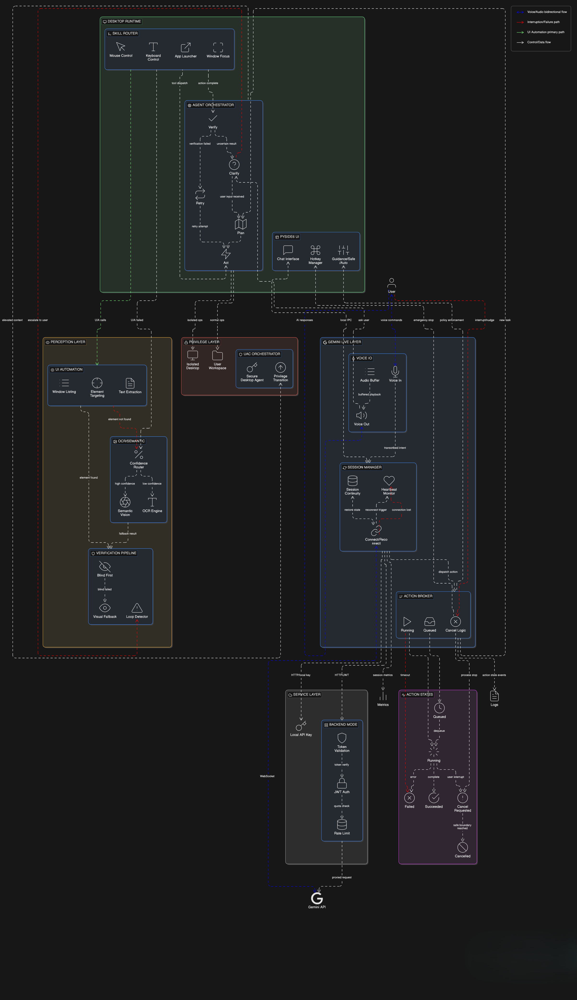

# PixelPilot


PixelPilot is a Windows desktop AI agent that executes computer tasks from natural language using:
- Gemini Live session mode by default (when available; can be toggled off)
- Hybrid blind + vision execution
- Native desktop automation (keyboard/mouse/UIA)
- Optional isolated Agent Desktop
- Gemini request/response planning and verification (`gemini-3-flash-preview` when the mode is not Live)

## Architecture



Detailed diagram: [src/logos/System-Architecture_Detailed.png](src/logos/System-Architecture_Detailed.png)

## Current Behavior (Important)

### Mode and workspace policy
- Modes are `GUIDANCE`, `SAFE`, `AUTO`.
- Any mode change forces workspace to `user`.
- Guidance is locked to `user` workspace:
  - `switch_workspace` to `agent` is coerced to `user` in Guidance.
  - Guidance task startup defensively re-checks and forces `user`.

### Passthrough/click-through policy
- `agent` workspace: click-through is always OFF.
- `user` workspace, non-Live: click-through is ON only while a task is actively running, then OFF when done/stopped.
- `user` workspace, Live enabled: click-through is ON only while a mutating Live action is `queued`, `running`, or `cancel_requested`; otherwise OFF.

### Live startup default
- When Live is available, Live mode starts ON by default.
- Users can toggle Live OFF from the Live button to return to non-Live task execution.

### Focus restore on passthrough transitions
- When click-through is disabled, PixelPilot stores the last external foreground window handle.
- When click-through is enabled again, it restores only if that window is minimized, then brings it to foreground (`SetForegroundWindow`).
- Invalid/missing handles are ignored safely.

## Key Features

- Blind-first orchestration with step-1 workspace decision.
- UI Automation blind mode with:
  - snapshots
  - `ui_element_id` targeting
  - text extraction (`read_ui_text`)
  - window listing/focus (`list_windows`, `focus_window`)
- Vision pipeline:
  - local OCR/CV (`EasyOCR` + OpenCV) first
  - optional Robotics-ER (`gemini-robotics-er-1.5-preview`) fallback
  - annotated overlay + optional reference sheet
- Verification pipeline:
  - blind verification first when appropriate
  - visual verification when blind evidence is insufficient
- Loop detection and clarification flow.
- UAC secure desktop support through orchestrator/agent helpers (`src/uac/`).
- Optional Agent Desktop isolation with sidecar preview and process tracking.
- Skills:
  - `media`
  - `browser`
  - `system`
  - `timer`
- Login/backend mode plus direct API mode.
- Global Windows hotkeys (work even when the overlay is unfocused/click-through).

## Hotkeys

- `Ctrl+Shift+Z`: Toggle click-through manually
- `Ctrl+Shift+X`: Stop current task / request stop in Live
- `Ctrl+Shift+Q`: Quit
- `Ctrl+Shift+M`: Hide/restore app (background toggle)
- `Ctrl+Shift+D`: Toggle details panel

## UI Notes

- Default UI is a compact bar.
- Details panel expands/collapses.
- Minimize hides to tray/background; restore from tray or `Ctrl+Shift+M`.
- Workspace badge indicates `user` vs `agent`.
- Agent preview sidecar is available only when workspace is `agent`.

## Tech Stack

- Desktop app: Python + PySide6
- AI: Google GenAI SDK (`google-genai`)
- Vision: EasyOCR, OpenCV, Pillow
- Automation: pyautogui, ctypes/Win32, keyboard, UIAutomation (`uiautomation`)
- Live mode audio: PyAudio
- Optional backend: FastAPI + MongoDB + Redis + JWT
- Optional web portal: React + TypeScript + Vite (`web/`)

## Installation

### Standard install

```bash
python install.py
```

Installer does:
- creates `venv`
- installs `requirements.txt`
- prefetches EasyOCR models
- prebuilds app index cache
- compiles UAC helpers (`src/uac/orchestrator.py`, `src/uac/agent.py`)
- creates scheduled tasks:
  - `PixelPilotUACOrchestrator` (SYSTEM startup task)
  - `PixelPilotApp` (launcher task)
- creates desktop shortcut `Pixel Pilot.lnk`

### Dependencies only (skip tasks/shortcut)

```bash
python install.py --no-tasks
```

## Configuration

Create `.env` in repo root (you can start from `env.example`).

```env
GEMINI_API_KEY=your_api_key_here
GEMINI_MODEL=gemini-3-flash-preview
GEMINI_BASE_MODEL=gemini-3-flash-preview

ENABLE_GEMINI_LIVE_MODE=true
LIVE_MODE_DEFAULT_ENABLED=true
GEMINI_LIVE_MODEL=gemini-2.5-flash-native-audio-preview-12-2025
LIVE_ENABLE_IMAGE_INPUT=false
LIVE_ENABLE_VIDEO_STREAM=false
LIVE_VIDEO_FPS=1
LIVE_AUDIO_INPUT_RATE=16000
LIVE_AUDIO_OUTPUT_RATE=24000
LIVE_AUDIO_SPEAKER_QUEUE_MAX_CHUNKS=192
LIVE_AUDIO_SPEAKER_QUEUE_TRIM_TO_CHUNKS=144
LIVE_AUDIO_SPEAKER_BATCH_MAX_CHUNKS=8
LIVE_AUDIO_SPEAKER_BATCH_MAX_BYTES=65536
LIVE_VIDEO_MAX_SECONDS_BEFORE_ROTATE=105

DEFAULT_MODE=auto
AGENT_MODE=auto
VISION_MODE=ocr
BACKEND_URL=https://pixel-pilot-5jpy.onrender.com

# optional
PIXELPILOT_GATEWAY_TOKEN=pixelpilot-secret
```

Notes:
- Live mode availability currently requires direct API mode (`GEMINI_API_KEY` present).
- `LIVE_MODE_DEFAULT_ENABLED=true` means Live starts enabled whenever available.
- `LIVE_ENABLE_IMAGE_INPUT=false` avoids image/video realtime sends for native-audio models (prevents policy-violation disconnects).
- If `GEMINI_API_KEY` is missing, app uses backend auth/proxy mode.

## Run

```bash
.\venv\Scripts\python.exe .\src\main.py
```

Startup behavior:
- Direct mode (`GEMINI_API_KEY` present): no login dialog.
- When Live is available, Live mode is enabled by default at startup.
- Backend mode (no local key): login/register dialog appears.
- Login dialog also lets user paste/store an API key.

The app attempts admin relaunch at startup; if elevation is denied, it continues with limited capability.

## Optional Backend (FastAPI)

Backend code is in `backend/`.

1. Install dependencies:
```bash
cd backend
pip install -r requirements.txt
```

2. Configure `backend/.env`:
```env
GEMINI_API_KEY=your_backend_key
MONGODB_URI=your_mongodb_uri
REDIS_URI=redis://localhost:6379
JWT_SECRET=change_me
```

3. Run:
```bash
uvicorn main:app --host 0.0.0.0 --port 8000 --reload
```

4. Point desktop app:
```env
BACKEND_URL=http://localhost:8000
```

Backend endpoints:
- `POST /auth/register`
- `POST /auth/login`
- `GET /auth/me`
- `POST /v1/generate` (JWT protected, Redis rate limited)
- `GET /health`

Default rate limit logic in backend: 200 requests/day per user.

## Optional Web Portal

Web app lives in `web/`.

```bash
cd web
npm install
npm run dev
```

## Optional Gateway

Gateway implementation exists at `src/services/gateway.py`.
It is not auto-started by `src/main.py`; integrate/start it explicitly in your own launcher process.

Expected payload format:

```json
{
  "auth": "pixelpilot-secret",
  "command": "Open calculator and compute 25*34",
  "params": {
    "mode": "auto"
  }
}
```

## Logs and Runtime Artifacts

- App logs: `logs/pixelpilot.log`
- Launcher logs (scheduled task install path): `logs/app_launch.log`
- Media/debug captures: `media/`
- Auth token cache: `%USERPROFILE%\\.pixelpilot\\auth.json`
- App index cache: `%USERPROFILE%\\.pixelpilot\\app_index.json`

## Uninstall

```bash
python uninstall.py
```

Useful flags:
- `--no-tasks`
- `--keep-venv`
- `--keep-dist`
- `--keep-build`
- `--keep-logs`
- `--keep-media`
- `--keep-cache`

## Troubleshooting

- App opens then exits: confirm valid `GEMINI_API_KEY` or working backend login.
- Backend errors: verify `BACKEND_URL` and backend `/health`.
- UAC flow not working:
  - Re-run `python install.py` as Administrator.
  - Confirm `PixelPilotUACOrchestrator` task exists and is running.
- Check logs in `logs/pixelpilot.log`.
